# ⏰ ReveilleX — Smart Alarm Backend

A production-oriented backend system for smart alarm management built using Spring Boot, Spring Security, JWT Authentication, Redis, PostgreSQL, Docker, and Nginx.

The application provides secure authentication, email OTP verification, refresh token rotation, alarm CRUD operations, challenge-based alarm dismissal, API documentation, and containerized deployment.

---

# 🚀 Features

## Authentication & Security

* JWT Authentication
* Refresh Token Rotation
* Spring Security
* BCrypt Password Encryption
* Role-Based Authorization
* Secure Protected APIs

## Email OTP Verification

* Registration OTP Verification
* Forgot Password OTP Verification
* OTP Resend Functionality
* OTP Expiration Handling
* Redis-Based OTP Storage

## Alarm Management

* Create Alarm
* View Alarms
* Update Alarm
* Delete Alarm
* Enable / Disable Alarm
* Challenge-Based Alarm Dismissal

## Challenge System

* Math Challenge Generation
* Math Challenge Verification
* QR Challenge Generation
* QR Challenge Verification

## API Documentation

* Swagger UI
* OpenAPI 3 Documentation

## Infrastructure

* Dockerized Application
* Docker Compose
* PostgreSQL Database
* Redis Cache
* Nginx Reverse Proxy

---

# 🛠️ Tech Stack

## Backend

* Java 17
* Spring Boot
* Spring Security
* Spring Data JPA
* Hibernate

## Authentication

* JWT
* Refresh Tokens
* BCrypt

## Database & Cache

* PostgreSQL
* Redis

## Email Service

* SendGrid

## DevOps

* Docker
* Docker Compose
* Nginx

## Documentation

* Swagger UI
* OpenAPI 3

## Build Tool

* Maven

---


## ARCHITECTURAL DIAGRAMS


# Screenshots

## System Architecture

### Overall Backend Architecture

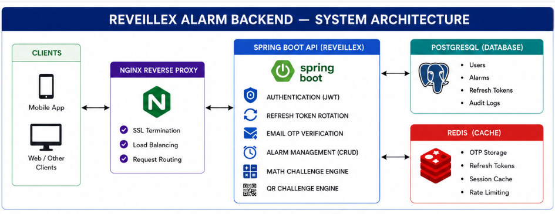

The architecture consists of:

- Spring Boot REST API
- PostgreSQL Database
- Redis Cache
- JWT Authentication
- Email OTP Verification
- Nginx Reverse Proxy
- Dockerized Services
- Math & QR Challenge Engines

---

## Authentication Flow

### User Registration → OTP Verification → JWT Issuance

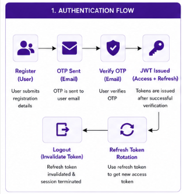

Authentication workflow:

1. User registers
2. OTP sent via email
3. OTP verification
4. JWT access & refresh tokens generated
5. Refresh token rotation
6. Secure logout

---

## Alarm Management Flow

### Alarm Lifecycle

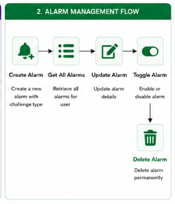

Alarm operations:

- Create Alarm
- Get Alarms
- Update Alarm
- Toggle Alarm
- Delete Alarm

---

## Alarm Dismissal Challenge Flow

### Math Challenge & QR Challenge Verification

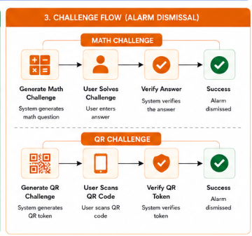

Alarm dismissal requires challenge completion:

- Math Challenge
- QR Challenge
- Verification Process
- Successful Alarm Dismissal

---

## CI/CD Pipeline

### GitHub Actions + Docker Build Pipeline

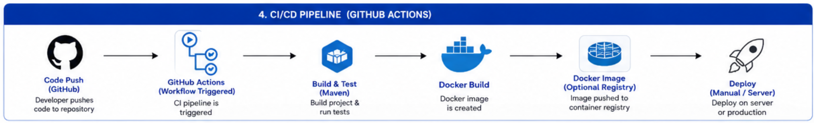

Pipeline stages:

1. Code Push
2. GitHub Actions
3. Maven Build & Test
4. Docker Image Build
5. Docker Image Registry

---

## JWT FLOw

# How access token (JWT TOKEN) and Refresh Token works

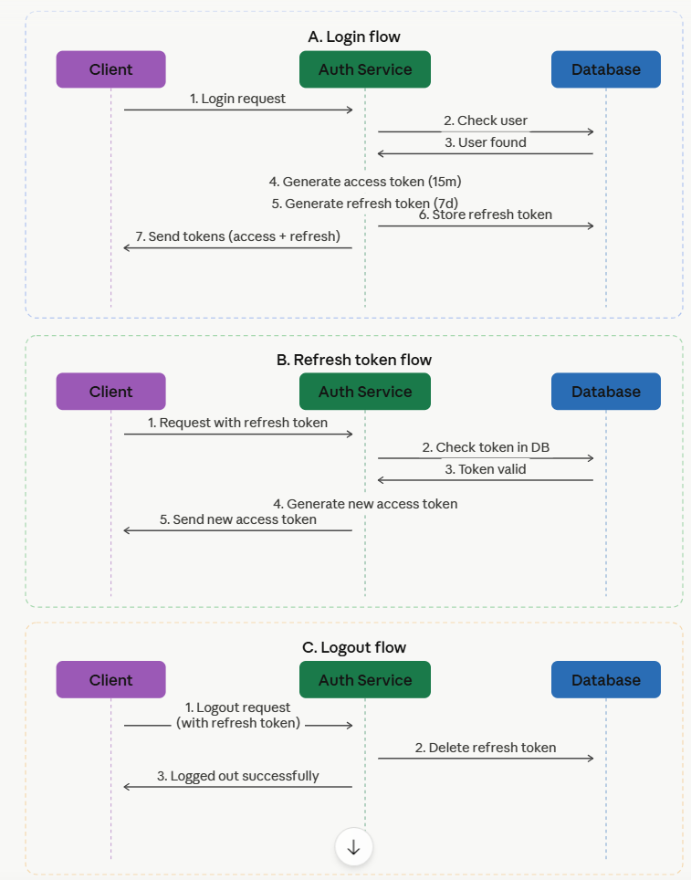

---

## Key Features Overview

### Backend Capabilities

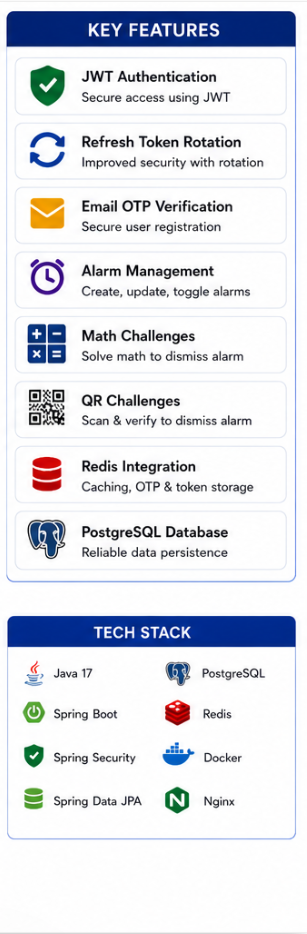

Included features:

- JWT Authentication
- Refresh Token Rotation
- Email OTP Verification
- Alarm CRUD
- Math Challenge Engine
- QR Challenge Engine
- Redis Caching
- PostgreSQL Persistence

- 

--- 


# 🏗️ System Architecture

```text
       User/Client
            │
            ▼
     Nginx Reverse Proxy
            │
            ▼
      Spring Boot API
            │
      ┌─────┴─────┐
      ▼           ▼
 PostgreSQL     Redis
      │           │
      └─────┬─────┘
            ▼
        SendGrid
```

---

# 🔄 Authentication Workflow

```text
Register User
      │
      ▼
Send Email OTP
      │
      ▼
Verify OTP
      │
      ▼
Login
      │
      ▼
JWT Access Token
      │
      ▼
Protected APIs
      │
      ▼
Refresh Token Rotation
```

---

# ⏰ Alarm Workflow

```text
Create Alarm
      │
      ▼
Alarm Triggers
      │
      ▼
Challenge Generated
      │
 ┌────┴─────┐
 ▼          ▼
Math       QR
Challenge Challenge
 ▼          ▼
Verify Challenge
      │
      ▼
Alarm Dismissed
```

---

# 📁 Project Structure

```text
src/main/java

├── config
├── controller
├── dto
├── entities
├── enums
├── exception
├── filter
├── helper
├── principal
├── repositories
├── response
├── service
├── util
└── ReveilleXAlarmApplication
```

---

# 🔐 Authentication APIs

| Method | Endpoint                         |
| ------ | -------------------------------- |
| POST   | /api/v1/auth/register            |
| POST   | /api/v1/auth/verify-registration |
| POST   | /api/v1/auth/login               |
| POST   | /api/v1/auth/refresh             |
| POST   | /api/v1/auth/logout              |
| POST   | /api/v1/auth/reset-password      |

---

# 📧 OTP APIs

| Method | Endpoint                            |
| ------ | ----------------------------------- |
| POST   | /api/v1/otp/forgot-password         |
| POST   | /api/v1/otp/verify-forgot-password  |
| POST   | /api/v1/otp/resend-registration-otp |
| POST   | /api/v1/otp/resend-forgot-password  |

---

# ⏰ Alarm APIs

| Method | Endpoint                   |
| ------ | -------------------------- |
| POST   | /api/v1/alarms             |
| GET    | /api/v1/alarms             |
| PUT    | /api/v1/alarms/{id}        |
| DELETE | /api/v1/alarms/{id}        |
| PATCH  | /api/v1/alarms/{id}/toggle |

---

# 🧮 Challenge APIs

## Math Challenge

| Method | Endpoint                          |
| ------ | --------------------------------- |
| GET    | /api/v1/challenges/math/{alarmId} |
| POST   | /api/v1/challenges/math/verify    |

## QR Challenge

| Method | Endpoint                        |
| ------ | ------------------------------- |
| GET    | /api/v1/challenges/qr/{alarmId} |
| POST   | /api/v1/challenges/qr/verify    |

---

# 📸 API Documentation Screenshots

## 1. User Registration

User submits registration details.


---

## 2. Registration OTP Sent

OTP is sent to the registered email address.

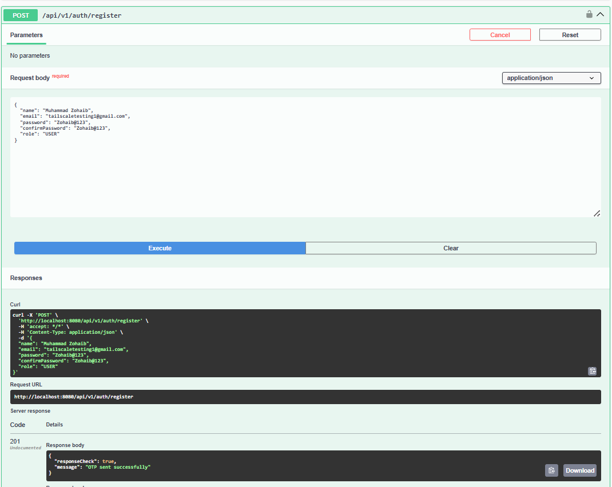

---

## 3. Verify Registration OTP

User verifies email ownership through OTP.

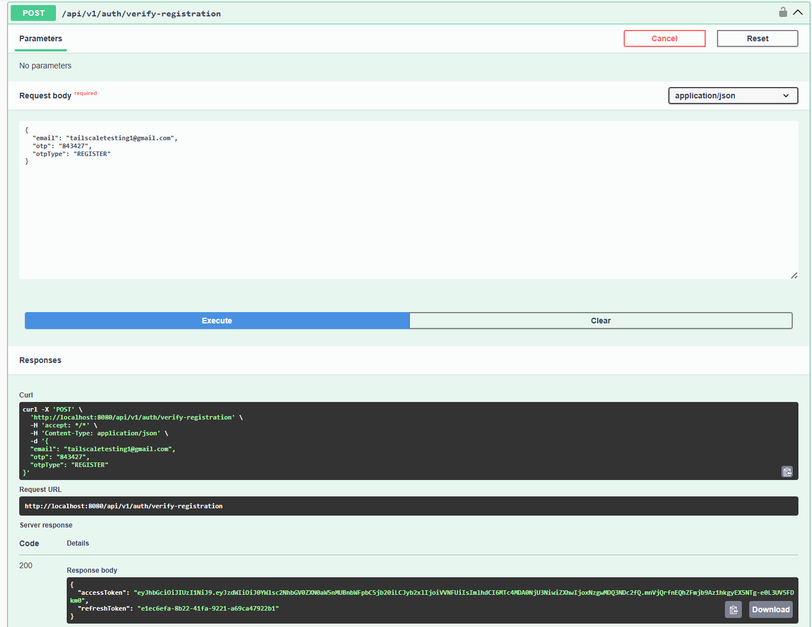

---

## 4. Login

Authenticated user login.

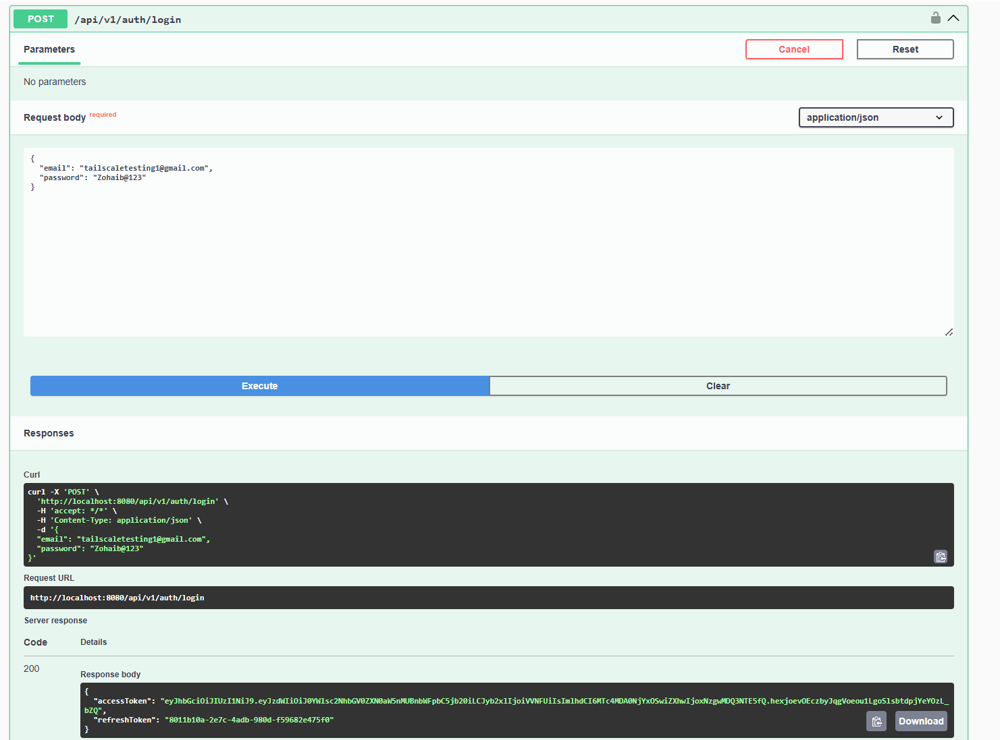

---

## 5. Refresh Access Token

Generate a new access token using refresh token rotation.

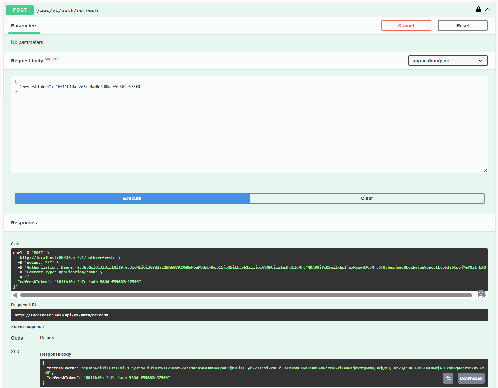

---

# ⏰ Alarm Management

---

## 6. Create Alarm

Create a new alarm with challenge configuration.

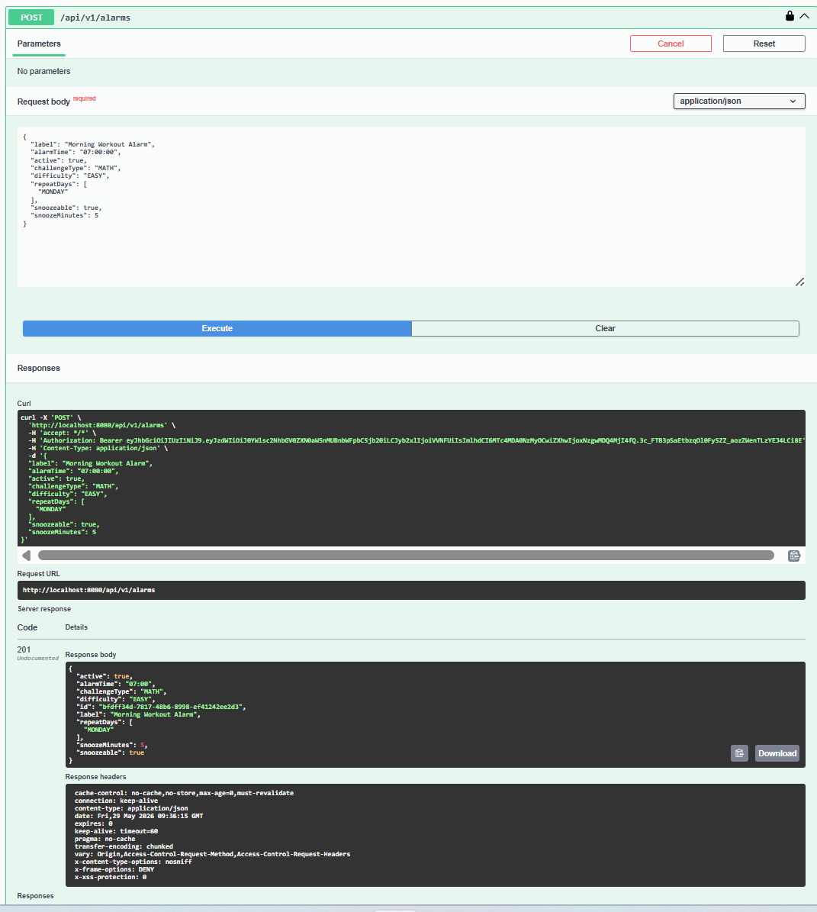

---

## 7. Get All Alarms

Retrieve all alarms belonging to the user.

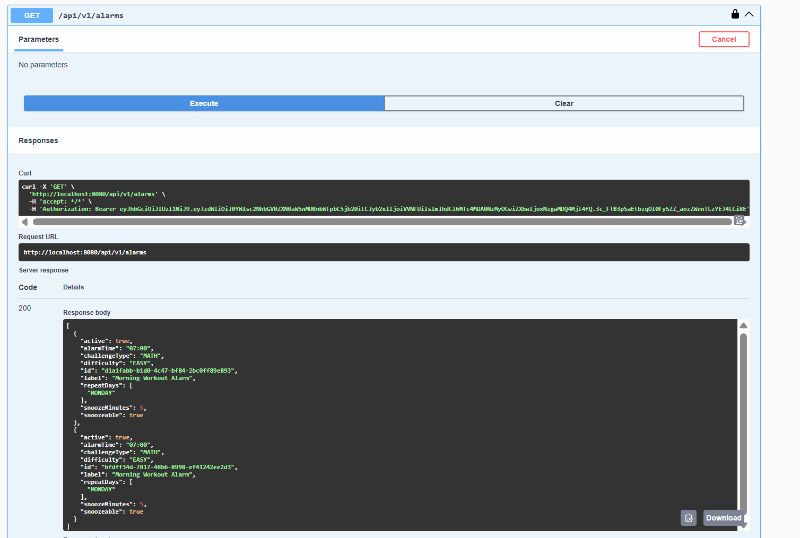

---

## 8. Update Alarm

Update alarm settings and challenge configuration.

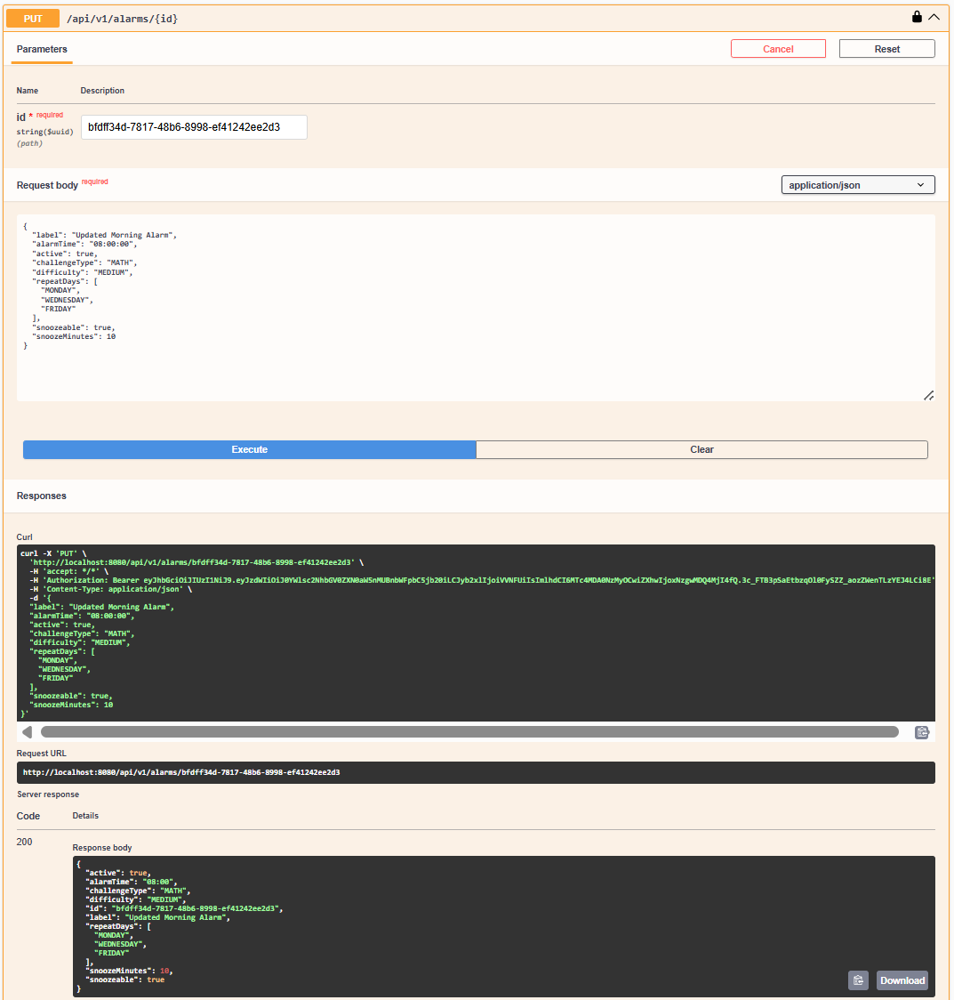

---

## 9. Toggle Alarm

Enable or disable an alarm.

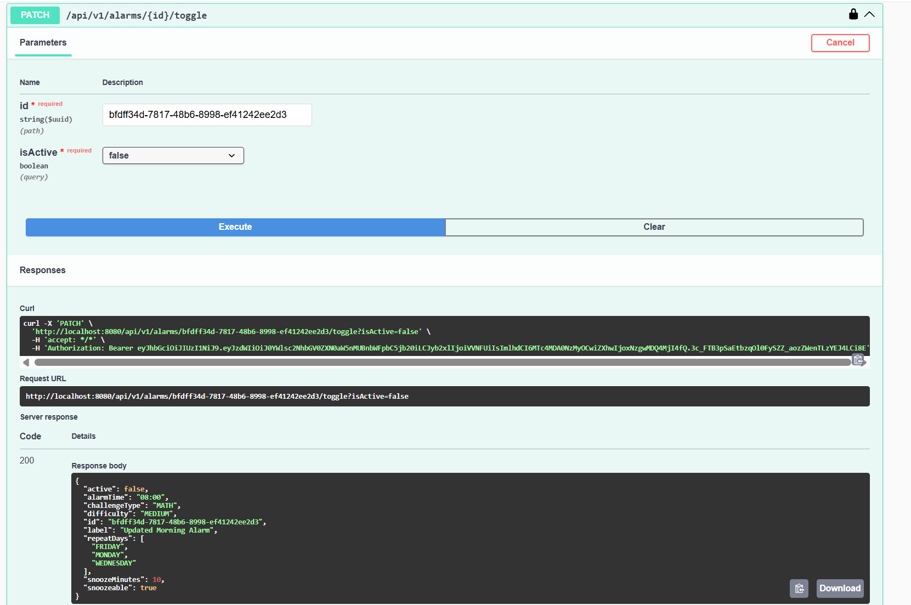

---

# 🧠 Math Challenge System

Users must solve a generated math problem before alarm dismissal.

---

## 10. Generate Math Challenge

Generate a challenge for alarm dismissal.

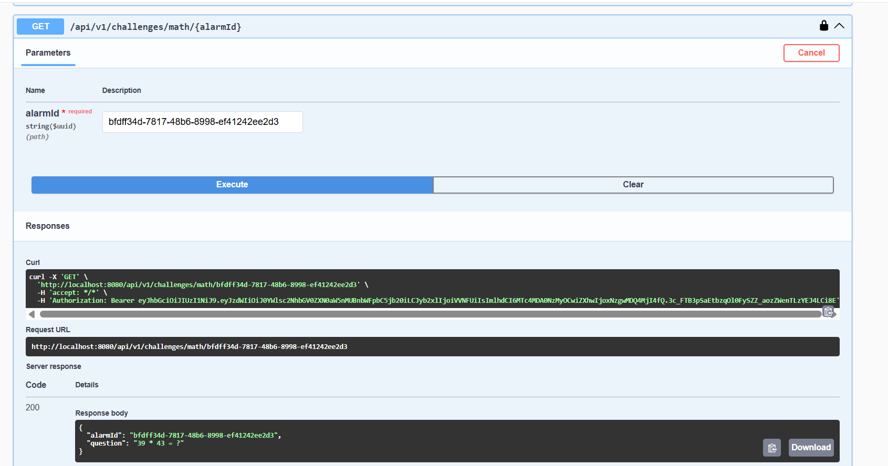

---

## 11. Verify Math Challenge (Failure)

Invalid answer submitted.

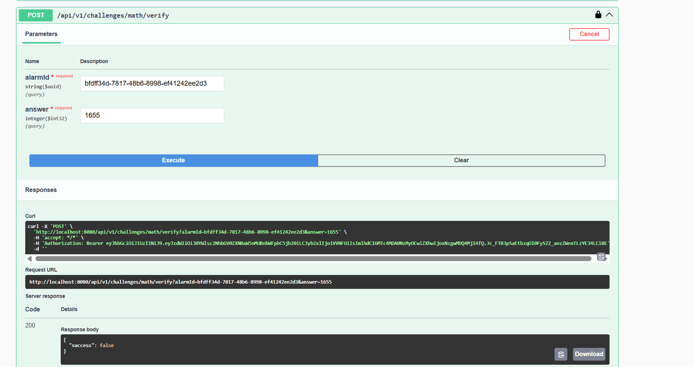

---

## 12. Verify Math Challenge (Success)

Correct answer submitted.

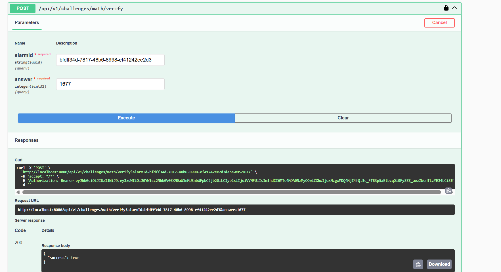

---

# 📱 QR Challenge System

Users can dismiss alarms by scanning and verifying a QR challenge.

---

## 13. Generate QR Challenge

Generate QR challenge token.

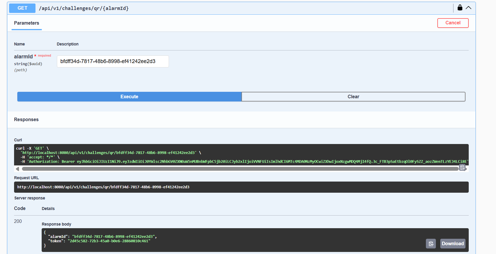

---

## 14. Verify QR Challenge

Verify QR challenge successfully.

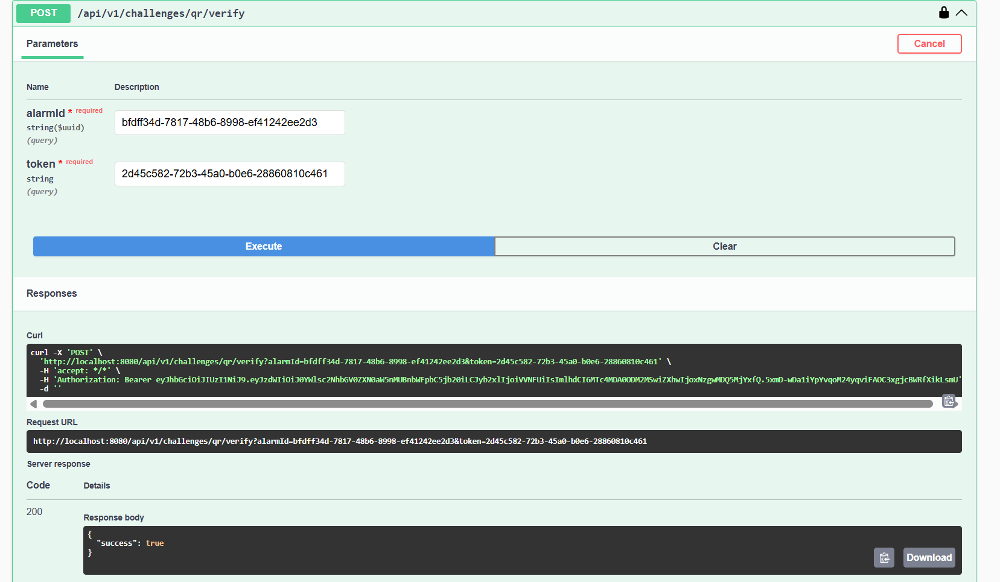

---

# 🚪 Logout

Invalidate refresh token and terminate session.

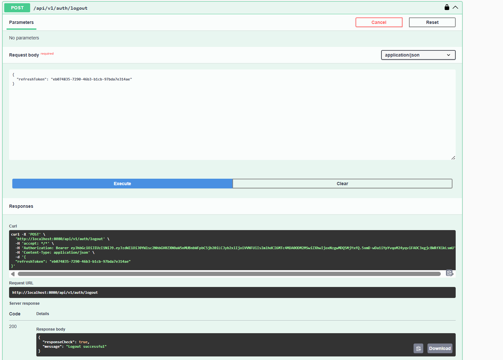

---

# 🐳 Docker Deployment

The application runs through Docker Compose using multiple containers:

* Spring Boot Application
* PostgreSQL Database
* Redis Cache
* Nginx Reverse Proxy

```bash
docker compose up -d
```

---

# ⚙️ Local Setup

## Clone Repository

```bash
git clone https://github.com/yourusername/reveillex-backend.git
```

## Enter Project

```bash
cd reveillex-backend
```

## Run Docker

```bash
docker compose up -d
```

## Run Application

```bash
mvn spring-boot:run
```

---

# 📖 Swagger Documentation

After starting the application:

```text
http://localhost:8080/swagger-ui/index.html
```

---

# 🚀 Future Improvements

* Mobile Push Notifications
* Kafka Event Streaming
* Kubernetes Deployment
* GitHub Actions CI/CD
* Monitoring & Logging
* Multi-Device Alarm Synchronization

---

# 👨‍💻 Author

**Muhammad Zohaib**

Backend Engineer | Spring Boot | Security | Cloud & DevOps

GitHub:
https://github.com/zohaib-dev-14
